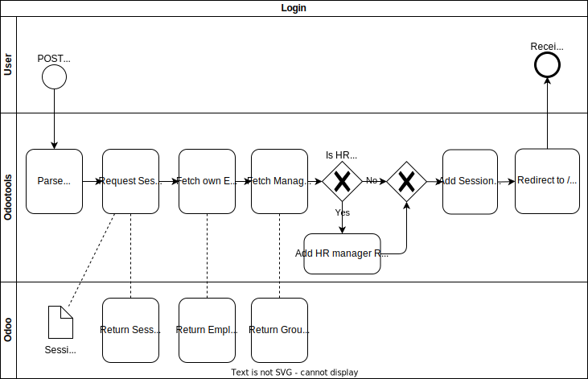
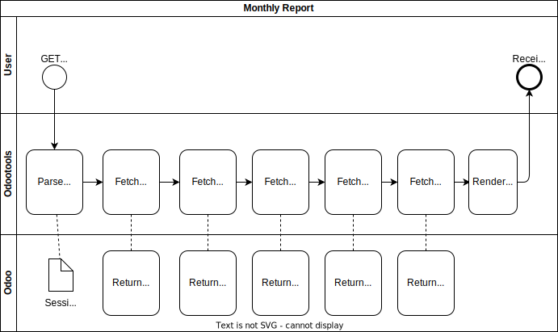

# Contributing

## Project structure

Source code:

* `pkg`: contains the source code in Go.
* `pkg/odoo`: contains the low-level code to read and write requests to Odoo backend.
* `pkg/timesheet`: contains the business logic to interpret the low-level responses from Odoo and calculate the overtime reports.
* `pkg/web`: contains the controllers and endpoints for the user interface.
* `templates`: contains the source code for the user interface (Go templates).
* `test`: contains some integration test files.

CI/CD:
* `chart`: contains the basic Helm chart to deploy Odootools to test and production.
* `envs`: contains the [Helmfile](https://github.com/helmfile/helmfile) that uses the Helm chart to customize the test and production environments.
* `.github`: contains the CI/CD workflows.

## Architecture

In the next section we cover a few examples of how Odootools interacts with Odoo.

### Login

1. A POST request to `/login` is done to the backend which contains the user's credentials.
2. The backend forwards the credentials to Odoo to get an Odoo session ID.
3. If credentials are valid, then backend requests additional data, like the Employee record for the user ID and possible group memberships.
4. A response is sent with a symmetrically encrypted cookie that the client is expected to save and include in future requests.
   The response is a redirect instruction to `/report`.

If the client makes requests to endpoints behind authentication, the backend checks if the cookie is present and decrypts it to get the Odoo session ID.
If not, the response always contains a redirection to the login form.

The encryption key is stored in a Kubernetes Secret and only available to the backend.

Note: If the cookie contains an expired Odoo session ID, the response is currently an error 500.
This is because the validation happens in Odoo and not in the backend, thus any query error is not further distinguished for its reason.
The result is an alert box in the UI, and to create a new Session, users have to re-login.

### Monthly Report

Below is a simplified high-level process diagram of how a monthly report is generated.

1. A GET request to `/report/:employee/:year/:month` is done with a session cookie and the backend then parses the query parameters.
2. A series of queries is made to Odoo based on the date range given (start and end of month).
   Each query to Odoo requires a session ID.
3. After all the necessary information is gathered, the report is calculated and then rendered.
4. The response is sent to the client.

### Yearly Report

The yearly report works very similar to the monthly report, except that the date range covers a whole year.
Depending on the employee, a somewhat "regular" employee can easily achieve 1000 individual attendance entries in Odoo.
Performance-wise this isn't much of a problem, a full yearly report takes about 1s to fully load and render the page, so that there are even next/previous buttons to browse throught the years of a single employee.
The backend presumably should sit relatively closely to Odoo itself on the same cluster (without The Internet between).

### Employee Report

People working in HR-like positions can generate a report over all employees for a given month.
In addition to the read-only reports that "normal" employees can do, this report also offers editing features.

The idea is that accounting roles are able to calculate and save the overtime in the employee's payslip.
To do that, the following things happens:

1. The payslip of the previous month is read to get the last-saved overtime, which serves as the starting point of the calculation.
2. The overtime of the current month is calculated atop of the previous month.
3. The accumulated overtime is being _proposed_ for the next payslip (provided the payslip has been created in Odoo first).

The accountant can then either accept the proposed overtime or adjust it before saving it in the payslip.
"Normal" employees cannot edit (save) anything in payslips.

To achieve a historic view over an employee's overtime, the "payslip" data type in Odoo is configured with a custom property `x_overtime`.

### Help page

The help page under `/help` serves as an explanation page.
It explains the rules when and how overtime is calculated and applied.

If there are rule changes and handling of special cases, it should be documented here as well.

## User Interface

The UI is a server-rendered app and rendered using Go templates.
The styling is supported with Bootstrap.
Any dynamic content like links and variables are being generated from the `*_view.go` files.

All static and generated assets are baked into the Go binary during the build process.
This allows to bundle a complete app in a single docker image, no single external CDN or similar is required to serve any CSS or javascripts.

### Why not an SPA and offload all work into the user's browser?

CORS.
Browsers won't connect to Odoo from somewhere else (which is fine).

## Odoo Development Notes

Idea brainstorming:
https://discuss.vshn.net/t/automate-over-undertime-calculation/399/6

See also [Odoo API notes](./docs/odoo.md)

### Holidays

Holidays generally don't influence overtime.
Odoo just calculates the monthly work hours, minus weekends and leaves, multiplied FTE ratio.

In case of VSHN, we have special leave type "Unpaid" - which Odoo treats as normal leaves, but VSHN treats as undertime.

VSHN only allows "full leave days" in respect to FTE ratio.
So, one cannot consume 0.5 leave days, only 1.
In the end it doesn't matter:
- Consuming 1 full day but still work on this day results in overtime, but reduces holidays
- Not using a leave day, but only work half day results in undertime, but still having an additional holiday.
  At the end of the year, excess holidays are transformed into overtime.

### Workload ratio

The workload ratio can be retrieved from Odoo via the "Contracts" model.
However, special read access needs to be granted so that they can be queried for their own user.
